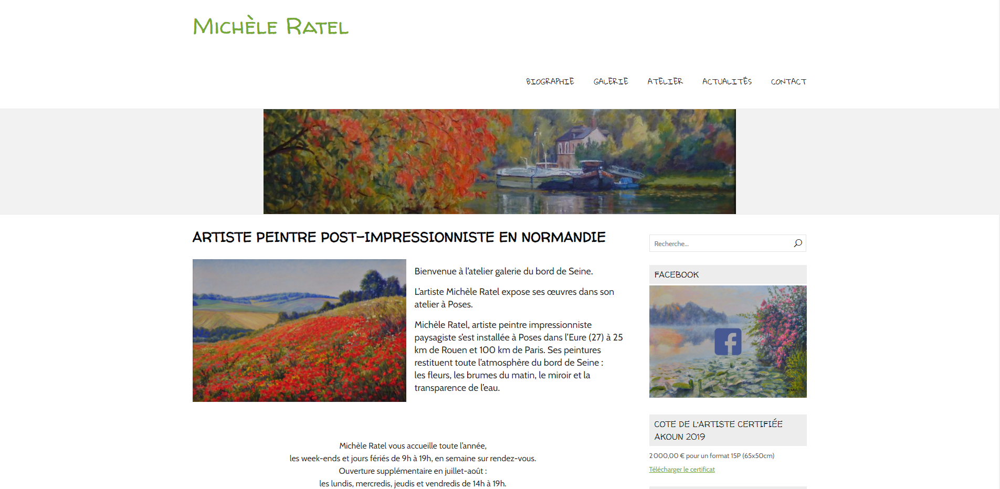

# Bienvenue sur le site professionnel de Michèle Ratel !

**Objectif** : Améliorer le site professionnel de Michèle Ratel.
             : http://www.mratel.fr/

**Lien des consignes** : https://slamwiki2.kobject.net/ateliers/missions/refonte

**Lien du site** : http://62.210.83.115:11208/wordpress/

Réalisé par Louka Fauvel et Alexandre Gobé dans le cadre d'un projet d'étude en BTS 1 SIO en décembre 2020 au SupAvenir Sainte-Ursule de Caen.

**Logiciel utilisé** : Wordpress
**Thème utilisé** : NatureSpace
**Pluggin utilisé** : WPForms Lite - Envira Gallery

**Screenshots** :

**A venir** : Au fur et à mesure, l'artiste peintre pourra ajouter des tableaux dans sa galerie.
